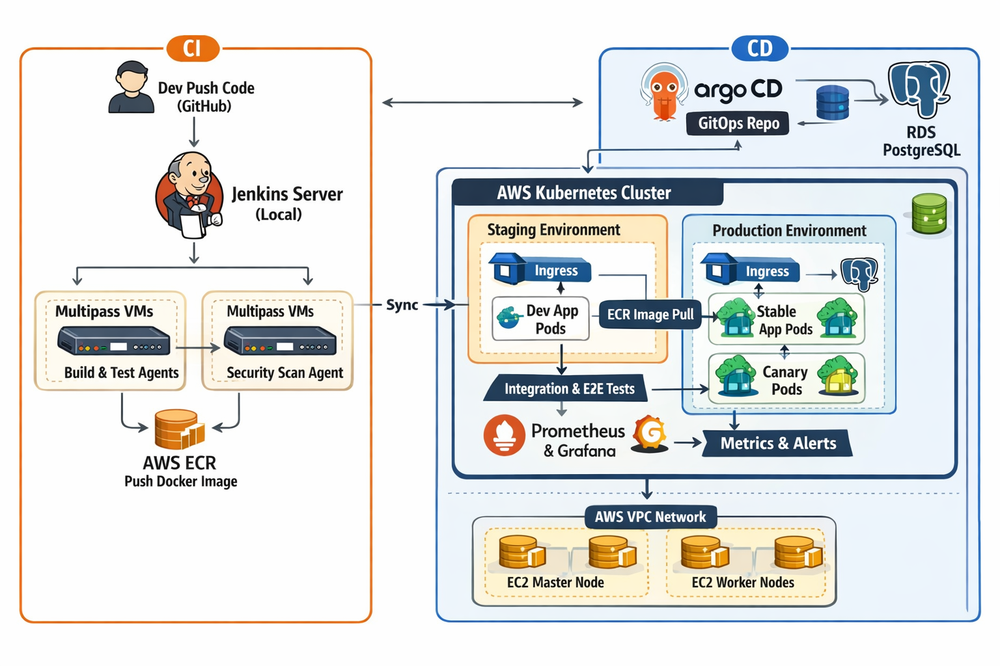

# Production-Grade CI/CD with Jenkins, GitOps & Kubernetes

## 📌 Overview

This repository demonstrates a **real-world, production-grade CI/CD architecture** built step by step, focusing on **strong fundamentals**, **clear architecture**, and **industry-correct practices** rather than shortcuts or toy examples.

The project is intentionally developed **slowly and incrementally**, mirroring how systems evolve in real engineering teams.

Key goals of this project:

- Understand CI/CD deeply, not superficially
- Separate responsibilities between CI and CD
- Learn Kubernetes and cloud infrastructure the right way
- Apply networking concepts while building systems
- Keep everything cost-optimized and free-tier friendly

---

## 🧱 High-Level Architecture



### Architecture Summary

1. Developers push code to GitHub
2. Jenkins handles **Continuous Integration (CI)** only
3. Docker images are built and scanned
4. Images are pushed to AWS ECR
5. GitOps manifests are updated
6. Argo CD reconciles desired state into Kubernetes
7. Applications are deployed using **canary deployments**
8. Prometheus and Grafana monitor system health

---

## 🛠️ Technology Stack

### Continuous Integration (CI)

- Jenkins (controller running locally)
- Jenkins agents using Multipass VMs
- Docker
- Trivy for container vulnerability scanning

### Continuous Delivery (CD)

- GitOps methodology
- Argo CD
- Declarative Kubernetes manifests

### Runtime & Cloud Infrastructure

- Self-managed Kubernetes cluster using kubeadm
- AWS EC2 (free-tier focused)
- AWS Elastic Container Registry (ECR)
- AWS RDS (PostgreSQL)
- Region: ap-south-1

### Observability

- Prometheus (metrics collection)
- Grafana (dashboards & visualization)
- Alerting based on metrics

---

## 🔄 CI vs CD — Responsibility Split (CRITICAL DESIGN)

| Component  | Responsibility                                |
| ---------- | --------------------------------------------- |
| Jenkins    | CI only (lint, test, build, scan, push image) |
| Argo CD    | CD only (sync & deploy to Kubernetes)         |
| Kubernetes | Runtime environment                           |
| Jenkins    | ❌ Never deploys applications                 |
| Kubernetes | ❌ Never builds container images              |

This separation follows **modern production and GitOps best practices**.

---

## 🚀 Deployment Strategy

### Canary Deployments

- New versions are rolled out gradually
- Traffic is split between stable and canary pods
- Metrics determine success or rollback
- Enables safe production releases

This strategy was chosen because it offers **maximum real-world learning** and reflects how critical systems are deployed.

---

## 🌐 Networking Philosophy

Networking is **not treated as a separate phase**.

Instead, networking concepts are learned and applied **contextually** while building:

- VPC creation → IP addressing and CIDR
- Subnets → public vs private traffic flows
- Route tables → how traffic actually moves
- Security groups → firewall behavior
- Kubernetes networking → pod IPs, services, ingress
- CI/CD flows → tool-to-tool communication paths

Every networking decision is documented at the point where it is used.

---

## 💰 Cost Optimization Strategy

- AWS resources are limited to free-tier–friendly instances
- Kubernetes uses the minimum viable node count
- CI workloads run locally using Multipass
- Infrastructure is designed to be torn down when idle

Learning is prioritized **without unnecessary spending**.

---

## 📁 Repository Structure (Evolving Over Time)

```text
devops-gitops-cicd-project/
│
├── app/                  # Application source code (added later)
├── ci/                   # Jenkins pipelines and CI scripts
├── cd/                   # GitOps & Argo CD manifests
├── infrastructure/       # Terraform and Kubernetes setup
├── observability/        # Prometheus & Grafana configurations
├── docs/
│   └── architecture/     # Architecture diagrams
└── README.md

```

Folders are introduced **only when required**, keeping the repository clean and understandable.

---

## 🧭 Build & Learning Philosophy

- Slow, deliberate progress
- No skipping fundamentals
- Every command explained
- Every architectural choice justified
- Git history reflects real project evolution

This repository is treated as a **long-term learning system**, not a tutorial dump.

---

## 📌 Project Status

🚧 **Phase 0 – Repository & Architecture Setup (Completed)**

- Repository initialized
- Architecture documented
- Design decisions locked

🔜 **Next Phase**

- Jenkins CI foundations (controller, agent, pipeline skeleton)

---

## 🧠 What This Project Demonstrates (Interview View)

- Clear understanding of CI vs CD separation
- GitOps-based deployment strategy
- Kubernetes production concepts
- Canary deployments with observability
- Practical networking knowledge
- Cost-aware cloud design
- Professional repository structure and documentation

---

## 📖 Final Note

This repository grows continuously as new layers are added, refined, and documented.

The goal is not speed —
the goal is **depth, clarity, and correctness**.

```

```
